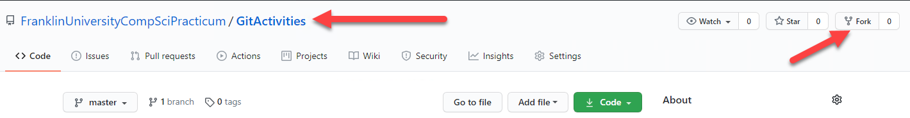
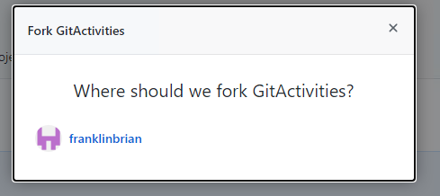
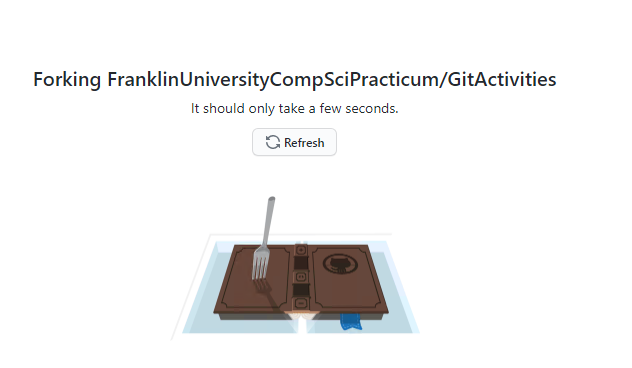
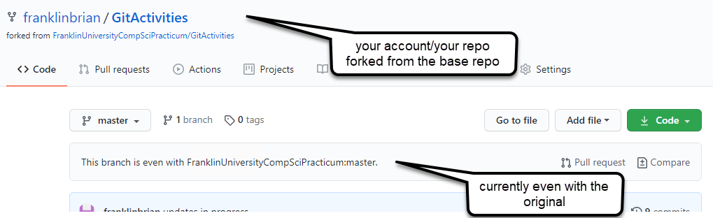
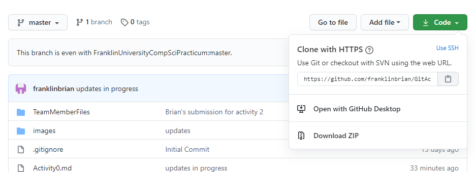
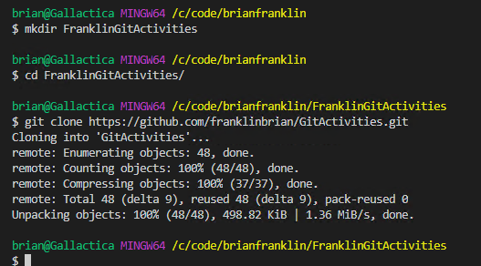
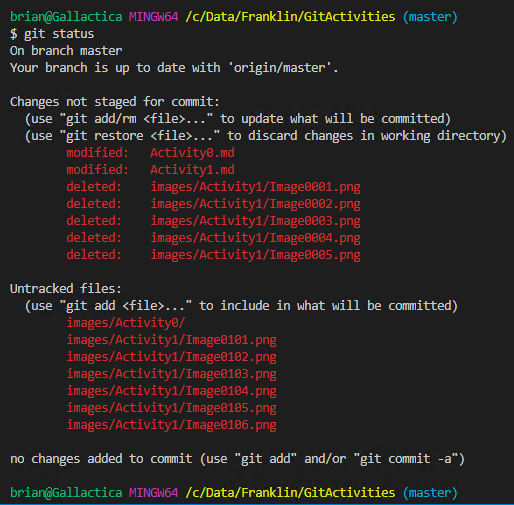
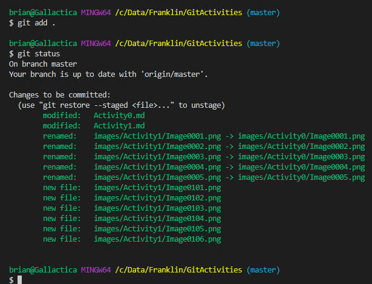

# Git Activity 1 - Forking a repository

This first activity will get you setup to complete the rest of the activities.

If you are struggling with any of the concepts required for this assignment, make sure to review the video course to find out more about how to perform a specific command, or just get more practice and understanding of the topic presented.


### Step 1: Fork this repository ###
To begin, you need to fork the repository.  Any time you are going to work on someone else's project, but want to potentially contribute, the correct way to proceed is to fork the repository.

1. You are already on this repository, so all you have to do is fork it to your own account.

    To begin, make sure you are on the correct repository, find the `Fork` button, and press the button to fork this repository to your own account.

    

2. Select the correct account where you want to fork the code.

    For example, select the account you use for the current Organization.

    

    While the operation is taking place, a dialog is shown that will give you information about what is happening.

    


3. Once the fork operation is completed, you have your own copy of the code.

    Your account name and repo are shown, as well as the account from which you cloned.

      

    Additionally, you are given information about the commits in your repo compared to the original.

### Step 2: Understand the relationship ##
To complete this activity, you just need to understand the relationship between your account and the base repository.

The base repository is where you forked, and your repository is where you will do the work.

1. Clone your repository.
    
    In order to do work locally, you'll need to clone your new repository.  Use the `Code` button to get the url, and clone the repository to a location you can easily remember and work with in the future.

      

    Use BASH or any of your favorite GIT clients to clone the repository locally.

    Copy the url, make any directories you need and make sure your command line is on that directory, then run the command:  

    ```
    git clone <your-repo-url>
    ```  

      

    You now have a local copy of your code to work with.

2. Make a quick change to see how all of this works.

    It doesn't matter what you do here, just add a file or modify an existing file, then save it.

    Once the file is saved, make sure you have the changes ready with a git status command: 

    ```  
    git status
    ```  

      

    Then run the command

    ```
    git add .
    ```

     

    Which will move your change from modified or untracked to staged.  

    >IMPORTANT: Changes will not commit if not staged.

    With the changes staged, run the command:  

    ```  
    git commit -m "My first commit after changes"
    ```  

    Finally, push the commit you just created locally to the remote repository:  

    ```
    git push origin master
    ```

    In future activiites, you will learn about branching strategies.

3. Open a pull request from your repo to the original.

    In a real project, if you were making modifications, you could request the original person accept your changes from a pull request.

    Opening a pull request now will connect your repository to the main repository in order to let htem accept your changes into the base repository. 