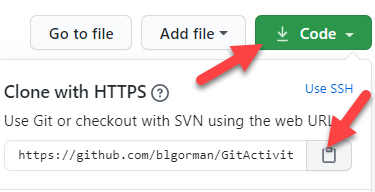
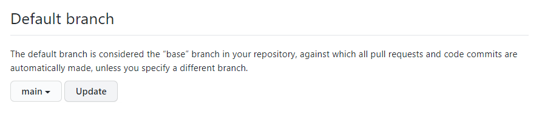

# Git Activity 1 - Cloning a repository and using the code as your own

The following set of instructions must be completed in order to satisfy the requirements of this assignment.

If you are struggling with any of the concepts required for this assignment, make sure to review the video course to find out more about how to perform a specific command, or just get more practice and understanding of the topic presented.


### Step 1: Clone this repository ###
To begin, you need to clone the repository.  There are many ways to do this, including, but not limited to:
*   Use a popular tool like GitKraken, VSCode with GitLens, or Visual Studio
*   Use the command line to simply run commands on your directory.

This guide provides instructions to complete the activity using the command line.

1. Make sure you have GIT installed on your local machine.  If you do not have Git installed, you can easily do so.

    Open a BASH terminal and type the command  

    ```
    git --version
    ```  

    You should see a printout similar to what is shown in Image 1   

    

    If you do not have BASH or you don't have the version shown, download and install GIT from: 

    ```  
    https://git-scm.com/downloads
    ```  
    If you are installing GIT for the first time, make sure to open a BASH terminal and run the following commands to validate that your account is setup with the correct credentials:  

    ```  
    git config --global user.name "Your.Name"
    git config --global user.email "youremail@yourprovider.com"
    ```  

2. Browse to the directory where you will be storing your solutions, such as `C:\\Projects`.  Make sure to browse to this repository in any browser https://github.com/FranklinUniversityCompSciPracticum/GitActivities  

    Use the dropdown for `Code` to get the URL to clone.  Review Image 2 for more details.  

    

    Click on the `clipboard` icon to copy the URL to your clipboard.  Then run the command git clone and paste the url to follow it (of course you can do this for any public GIT repository):  

    ```   
    git clone https://github.com/FranklinUniversityCompSciPracticum/GitActivities 
    ```  

    Wait for the clone operation to complete.  You now have a copy of the GIT repository local to your machine.  If you didn't have rights to the repository, you would have to disconnect it and setup your own.

### Setup your own Repository ###
For the first part of this activity, you need to setup your own repository.  To do this, you need to make sure you have a google account.

1. Create a new repository in your Github account

    Begin by logging into your account, then select the Repositories tab, and then hit the `New` button.  Review image 3 for more detail:  

      

    Give the repository a name, such as GitActivity1.  Choose public or private (If you are a student and you wish to remain anonymous or unseen by others you would need to choose private.  However, your instructor would also be unable to see your repository in this case, so you'd have to give them permission).

    Since you are using an established repository, you want to make sure to skip the `Initialize this repository...` and **DO NOT** add a gitignore or a license.  If you do any of these three things, you will have a commit and you will immediately have a merge conflict.

    Additionally, by leaving these options unset, you will get the correct list of commands to run to import your existing repository.

2. If you have setup your local repository locally, you will see the instructions you need to import an existing repository.

    The main thing you need to know, however, is that since you cloned this repository in step 1, you already have a remote set to **origin** by default.  Therefore, the first thing you need to do is remove it.

    In the BASH GIT command window where your code currently exists, run the following command:  

    ```
    git remote -vv
    ```  

    This will list out all of your current remotes.  The name "origin" is a variable.  If you would like to keep that remote, you can do so, just add a new remote with a different name.  For example, if you wanted to point to azure dev ops, you might do something like (do not run this):

    ```
    git remote add azuredevops https://yourorg@dev.azure.com/yourorg/yourproject/_git/project
    ```  
    Then you could push to either, but you would explicitly name the push remote every time like 

    ``` 
    git push origin <branch>
    git push azuredevops <branch>
    ```  

    Now that you see how that works, you are going to remove origin from this repository so you can just set the default *origin* to your new repository.

    Provided you see remote repositories listed when you ran the command `git remote -vv`, run the following command:  

    ```  
    git remote rm origin
    ```

    This will disconnect you from the existing repository that you do not own.

3. Now add your own repository as origin

    Now that you have origin free, you can add it by following the commands listed at GitHub.  note that both sets of commands contain the same two final lines.  Since you already have an existing repository, you can just run the last two lines, which will be something like:

    ```  
    git remote add origin https://github.com/<username>/<reponame>.git
    git push -u origin master  
    ```  

    If you wanted to eliminate previous history, you could have browsed to the location where you cloned the repo and delete the .git folder, then run the entire set of commands

    ```  
    git init
    git add .
    git commit -m "initial commit"
    git remote add origin https://github.com/<username>/<reponame>.git
    git push -u origin master  
    ```  

4. If you don't want to use master as your branch name anymore, you can easily rename the branch.

    To rename the branch, run the following command:

    ```  
    git branch -m master main
    git push origin HEAD:main
    ```  

    If, for some reason, this leaves master in tact and then you need to remove it, you can do so with the following commands:

    ```  
    git checkout main
    git branch -D master
    ```  

    Then you need to set your main branch as the default branch at GitHub and delete the master branch.

    At GitHub, find your branches, and then select the button to change default branch. Review Image 4 to see this in action.
    
    
     

    Then use the dropdown to select main, and then hit the update button:

    
     

You have now completed the activity where you have taken an existing repository and placed it under your own repository at github, with no connection to the original repository.


