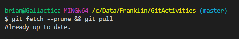
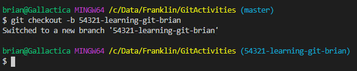
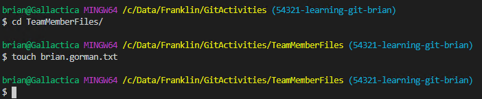
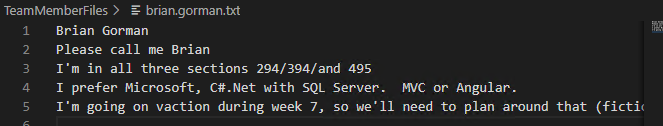
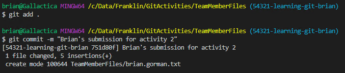
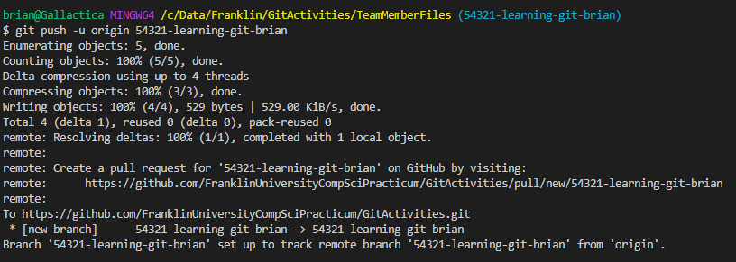
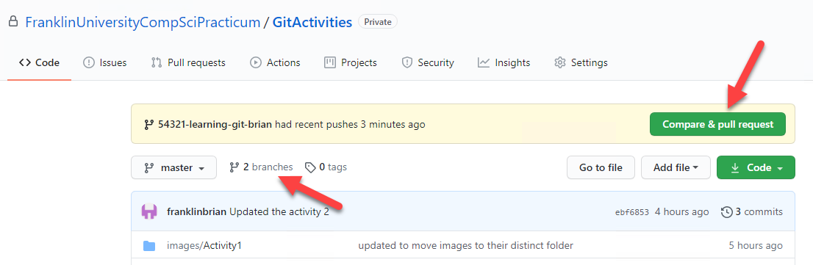
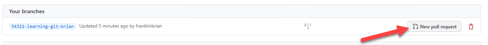
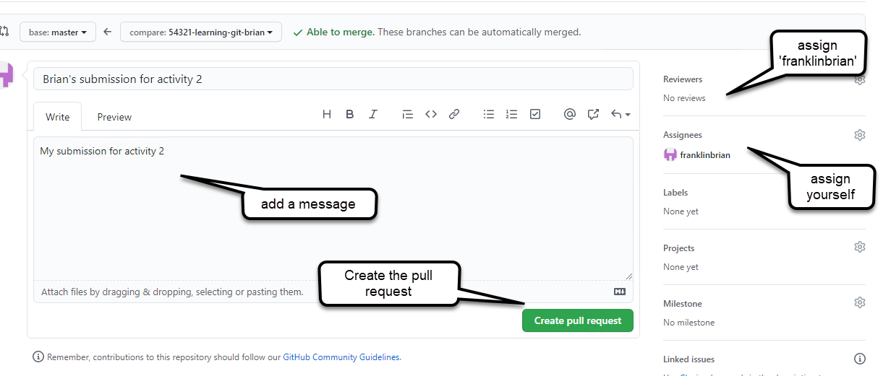
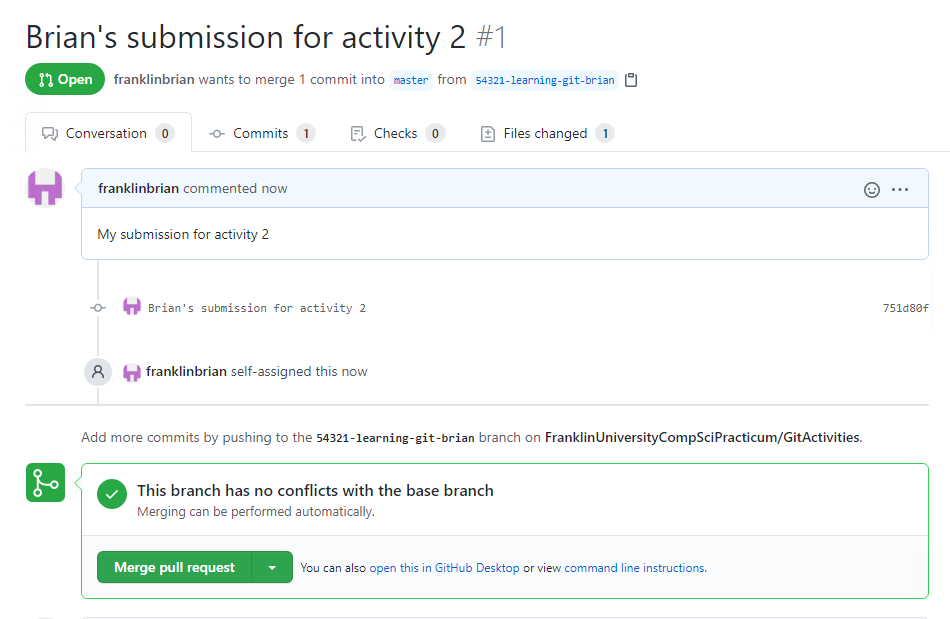

# Git Activity 2 - Work as a Team member #
In this second activity, you'll work like you are a member of the team.  This activity will give you a good overview of how you can work with the repository while minimizing your team conflicts.

### Step 1: Clone this repository ###
To begin, you need to clone the repository.  There are many ways to do this, including, but not limited to:
*   Use a popular tool like GitKraken, VSCode with GitLens, or Visual Studio
*   Use the command line to simply run commands on your directory.

This guide provides instructions to complete the activity using the command line.

1. Make sure you have GIT installed on your local machine.  If you do not have Git installed, you can easily do so.

    Open a BASH terminal and type the command  

    ```
    git --version
    ```  

    You should see a printout similar to what is shown in Image 1   

    

    If you do not have BASH or you don't have the version shown, download and install GIT from: 

    ```  
    https://git-scm.com/downloads
    ```  
    If you are installing GIT for the first time, make sure to open a BASH terminal and run the following commands to validate that your account is setup with the correct credentials:  

    ```  
    git config --global user.name "Your.Name"
    git config --global user.email "youremail@yourprovider.com"
    ```  

2. Browse to the directory where you will be storing your solutions, such as `C:\\Projects`.  Make sure to browse to this repository in any browser https://github.com/FranklinUniversityCompSciPracticum/GitActivities  

    Use the dropdown for `Code` to get the URL to clone.  Review Image 2 for more details.  

    

    Click on the `clipboard` icon to copy the URL to your clipboard.  Then run the command git clone and paste the url to follow it (of course you can do this for any public GIT repository):  

    ```   
    git clone https://github.com/FranklinUniversityCompSciPracticum/GitActivities 
    ```  

    Wait for the clone operation to complete.  You now have a copy of the GIT repository local to your machine.  As a member of this organization, you will have rights to be able to work against this repository.  


## Task 2: Checkout a new branch ##
Whenever you start on a new ticket, before you begin any work, you should make sure to get the latest version of the code, then checkout a branch.

In this task, you will run commands to make sure that you have the latest code and that you can do your work in the safest way possible.

1. Get the latest version of the code

    Even though you likely just cloned this repository, it's a good habit to make sure that you have the latest version of the code before checking out a new branch.

    Make sure you have cloned the repo and that your GIT tool is on the master branch.  If you are not currently on the master branch, you can move to the master branch with the command: 

    ```
    git checkout master
    ```  

    Once you are certain you are on the master branch, get the latest code using a fetch and a pull.  You can run them individually, or all at once.  To run them individually, use the following commands:  

    ```  
    git fetch
    git pull
    ```  

    If you would like to run the commands at the same time, you can use the following command: 

    ```  
    git fetch && git pull
    ```  

    Additionally, when branches have been deleted from the remote you can make sure to update your local references with the command: 

    ```
    git fetch --prune && git pull
    ```  
    Running this command will always make sure you get the latest version of the master branch and will let your local references know which branches have been deleted.

    


2. Create your new branch  

    With the latest version of the code, it's time to create your new branch.  Hopefully you have a new ticket that you are working on.  With a way to make a unique branch name, follow a pattern that makes sense to your team.  For this example, assume you have a ticket number 54321 and that it is for 'learning git'.  Create a new branch that includes the number, the simple summary, and your name.  For example:

    ```
    git checkout -b 54321-learning-git-brian
    ```

    In the event that the branch already exists, use your initials or your git username to ensure uniqueness.

    

3. Add a file

    In the folder `TeamMemberFiles` add a new file with your name, similar to this: 

    ```
    touch firstname.lastname.txt
    ```

    

    Then open the file for editing in your favorite text editor, and add the following information to the text file.

    * Your first and last name
    * How you like to be addressed (for example James might say "Call me Jim").
    * What is your section number (294, 394, 495)  
    * What is your preferred tech stack (Java/Microsoft/MySql/Sql/Postgres/Vue/Angular/React/HTML/PHP)
    * Anything else you want me to know (remember this is public to everyone in the course).

    

    Save and close the file.

4. Commit your changes

    To commit your changes, first you must stage your changes.  To do this, you would begin by running a command to stage the file changes

    ```
    git add .
    ```  

    Instead of the '.' you could explicitly name the file, but the '.' will include all of your changes.

    Next, commit the changes with the command:

    ```
    git commit -m "<YourName>'s submission for Activity 2"
    ```  
    

    Once the changes are committed, push the changes.

5. Push your changes

    Since you've never pushed this new branch, you should run the command

    ```
    git push -u origin <your-branch-name>
    ```
    

    This will push your changes to the remote repository.

6. Create a pull request.

    At GitHub, create a pull request for your changes and tag your instructor as a reviewer on the pull request.

    There are two ways to create a PR.  If you can see your branch has just made changes, you can easily click on the button to create a new PR.  If you can't see your branch having changes, then click on the branches tab. 

    

    If you clicked on branches, find your branch and create a new PR from this screen

    

    After clicking to create the pull request, fill out the comments and assign your instructor and yourself to the PR.  Then hit the final "Create" button

    

    You can see the PR is ready for review at any time.  The person assigned to review should review it and perform the merge.

    
    
This will complete your GIT activity.  In this activity, you learned how to work with a branch and create a pull request so that you can ensure your changes can be merged into the repository without creating a conflict.  